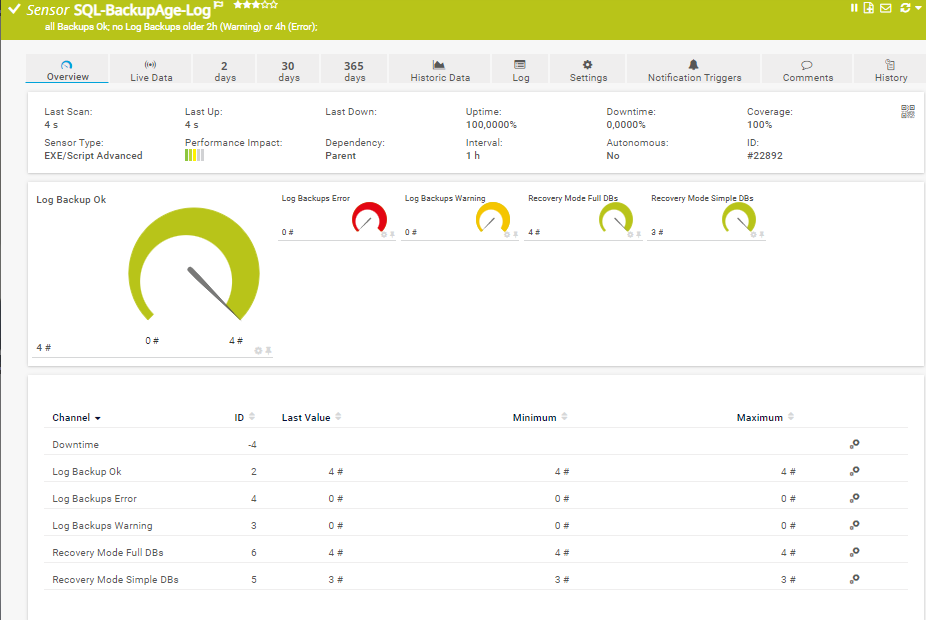
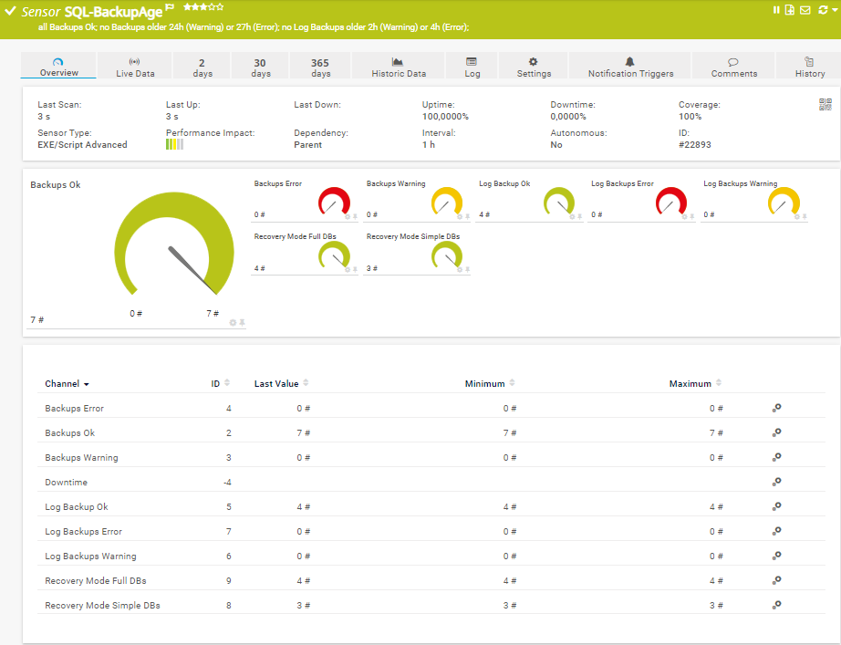
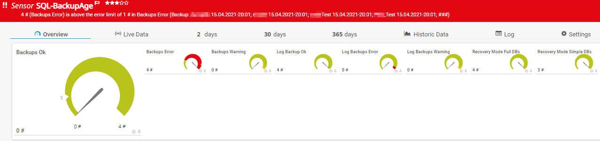

# PRTG-SQL-BackupAge
# About

## Project Owner:

Jannos-443

## Project Details

Checks SQL Backup, Log Backup and Differential Backup Age for every database!

| Parameter | Default Value |
| --- | --- |
| BackupAgeWarning | 24 (hours) |
| BackupAgeError | 27 (hours) |
| LogAgeWarning | 24 (hours) |
| LogAgeError | 27 (hours) |
| DiffAgeWarning | 24 (hours) |
| DiffAgeError | 27 (hours) |


## HOW TO
1. Make sure your SQL User/Windows User has the required SQL Server permission
   required Custom SQL Server Role permission:
   
   - SERVER	CONNECT SQL
   
   - SERVER	VIEW SERVER STATE
   
   - SERVER	CONNECT ANY DATABASE

2. Make sure the SQLServer Module exists on the Probe
   - `https://docs.microsoft.com/en-us/sql/powershell/download-sql-server-ps-module?view=sql-server-ver15`

3. Place `PRTG-SQL-BackupAge.ps1` under `C:\Program Files (x86)\PRTG Network Monitor\Custom Sensors\EXEXML`

4. Create new Sensor

   | Settings | Value |
   | --- | --- |
   | EXE/Script Advanced | PRTG-SQL-BackupAge.ps1 |
   | Parameters | `-sqlInstanz "SQL-Test" -IgnorePattern '(SQL-ABC)'` |
   | Scanning Interval | 10 minutes |


5. Set the "$IgnorePattern" or "$IgnoreScript" parameter to exclude databases


## Examples
SQL Backup Log Monitoring : `-sqlInstanz "SQL-Test" -LogAge`



SQL Backup Log Monitoring : `-sqlInstanz "SQL-Test" -LogAge -BackupAge`



Error:




database exceptions
------------------
You can either use the **parameter $IgnorePattern** to exclude a database on sensor basis, or set the **variable $IgnoreScript** within the script. Both variables take a regular expression as input to provide maximum flexibility. These regexes are then evaluated againt the **Database Name**

By default, the $IgnoreScript varialbe looks like this:

```powershell
$IgnoreScript = '^(Test-SQL-123|Test-SQL-12345.*)$' 
```

For more information about regular expressions in PowerShell, visit [Microsoft Docs](https://docs.microsoft.com/en-us/powershell/module/microsoft.powershell.core/about/about_regular_expressions).

".+" is one or more charakters
".*" is zero or more charakters