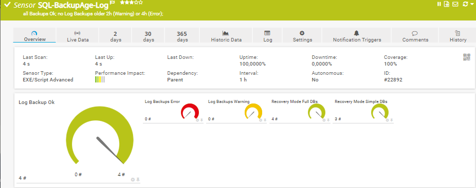
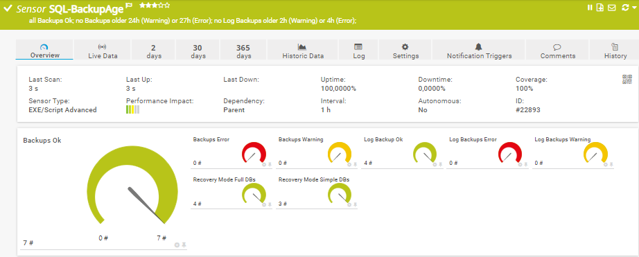
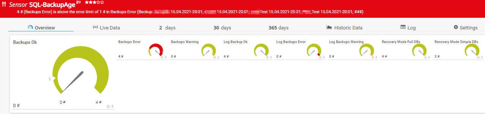

# PRTG-SQL-BackupAge
# About

## Project Owner:

Jannos-443

## Project Details

Checks SQL Backup, Log Backup and Differential Backup Age for every database!

| Parameter | Default Value |
| --- | --- |
| BackupAgeWarning | 24 (hours) |
| BackupAgeError | 27 (hours) |
| LogAgeWarning | 24 (hours) |
| LogAgeError | 27 (hours) |
| DiffAgeWarning | 24 (hours) |
| DiffAgeError | 27 (hours) |


## HOW TO
1. Make sure your SQL User/Windows User has the required SQL Server permission
   required Custom SQL Server Role permission:

   - SERVER	CONNECT SQL

   - SERVER	VIEW SERVER STATE

   - SERVER	CONNECT ANY DATABASE

2. Make sure the SQLServer Module exists on the Probe
   - `https://docs.microsoft.com/en-us/sql/powershell/download-sql-server-ps-module?view=sql-server-ver15`

3. Place `PRTG-SQL-BackupAge.ps1` under `C:\Program Files (x86)\PRTG Network Monitor\Custom Sensors\EXEXML`

4. Create new Sensor

   | Settings | Value |
   | --- | --- |
   | EXE/Script Advanced | PRTG-SQL-BackupAge.ps1 |
   | Parameters | `-sqlInstance "SQL-Test" -IgnorePattern '(SQL-ABC)'` |
   | Scanning Interval | 10 minutes |

5. Set the include/exclude parameter if required

## Examples

Run as Windows User
```powershell
... -sqlInstance "SQL-Test"
```

Explicit User and Password
```powershell
... -sqlInstance "SQL-Test" -username 'YourUser' -password 'YourPassword'
```

Named SQL Istance
```powershell
... -sqlInstance "SQL-Server01.example.com\InstanceTest"
```

Monitor SQL Database Backup
```powershell
... -sqlInstance "SQL-Test" -BackupAge
```

Monitor SQL Log Backup
```powershell
... -sqlInstance "SQL-Test" -LogAge
```

Monitor SQL Database Backup and SQL Log Backup
```powershell
... -sqlInstance "SQL-Test" -LogAge -BackupAge
```

Exclude Databases starting with Test_
```powershell
... -sqlInstance "SQL-Test" -LogAge -BackupAge -ExcludeDB '^(Test_.*)$'
```

Change Warning and Error Limit for Log Backup (5h Warning and 7h Error)
```powershell
... -sqlInstance "SQL-Test" -LogAge -BackupAge -LogAgeWarning '5' -LogAgeError '7'
```


## Screenshots







## Exceptions

You can either use the **parameter $IncludeDB/ExcludeDB** to exclude/include a database on sensor basis, or set the **variable $ExcludeScript/$IncludeScript** within the script. Both variables take a regular expression as input to provide maximum flexibility. These regexes are then evaluated againt the **Database Name**

For more information about regular expressions in PowerShell, visit [Microsoft Docs](https://docs.microsoft.com/en-us/powershell/module/microsoft.powershell.core/about/about_regular_expressions).

".+" is one or more charakters
".*" is zero or more charakters